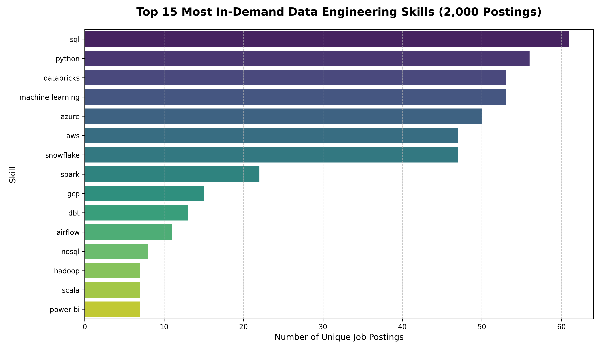

# 🚀 Serverless Job Market Data Lake & NLP Extraction

## 📌 Overview
An automated, serverless ELT (Extract, Load, Transform) pipeline built natively on AWS to extract, clean, and analyze job market data. Currently tracking Data Engineering, Data Science, and Machine Learning roles across the US. The infrastructure dynamically ingests live API data, uses custom NLP logic to extract highly-demanded technical skills from raw HTML descriptions, and constructs a highly scalable, queryable S3 Data Lake to analyze current market trends. The entire infrastructure is codified and provisioned using **Terraform**.

## 🏗 Architecture
This project utilizes an event-driven serverless architecture, emphasizing the separation of storage and compute:

1. **Extraction (EventBridge & Lambda):** An Amazon EventBridge scheduler triggers a Python Lambda function daily. This function hits the Adzuna API to pull raw job postings and lands the JSON data into an S3 "Inbox" bucket.
2. **Processing & NLP (S3 Event & Lambda):** An S3 event notification acts as a tripwire. When raw data lands, it instantly triggers a second Lambda function. This function strips HTML tags and utilizes custom NLP/regex logic to extract specific technical skills (Python, SQL, AWS, Databricks, etc.), writing the cleaned data to a "Processed" S3 prefix in JSON Lines (JSONL) format.
3. **Compute & Deduplication (Athena & Glue):** AWS Glue catalogs the JSONL files, and Amazon Athena acts as the serverless query engine. To handle API deduplication at scale without bottlenecking ingestion, advanced SQL Window Functions (`ROW_NUMBER() OVER(PARTITION BY...)`) are used to ensure data integrity during analysis.
4. **Analytics (Jupyter & awswrangler):** A local Jupyter Notebook uses the `awswrangler` library to push heavy SQL compute to the AWS cloud, fetching only the final aggregated Pandas DataFrame to local memory for visualization.

## 📊 Market Insights
*Based on a sample of 2,000+ deduplicated Data Engineer job postings.*

## 🛠 Tech Stack
* **Cloud:** AWS (S3, Lambda, EventBridge, Athena, Glue, IAM)
* **Infrastructure as Code (IaC):** Terraform
* **Languages:** Python 3.9, SQL (Presto/Trino)
* **Data Science / EDA:** Pandas, AWS Data Wrangler, Seaborn, Jupyter, Regex
* **Data Format:** JSON Lines (JSONL)

## 🚀 Future Roadmap
* **CI/CD Integration:** Set up GitHub Actions to automatically deploy Terraform changes and update Lambda zip packages upon code push.
* **LLM Integration:** Upgrade the regex-based skill extraction to utilize a lightweight open-source LLM for more nuanced context extraction from job descriptions.